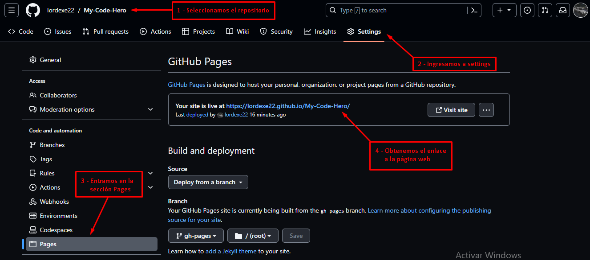

# My Code Hero
Este repositorio es un catalogo con todas las tecnologias que he estudiado y aqui se moldean los conocimientos que he adquirido a lo largo del tiempo.

A lo largo de este documento se va a detallar como se ha implementado esta página

### Secciones
* <a href="#t1">Configuración de github pages</a>
* <a href="#t2">Creación de la página web</a>

<div id="t1"></div>

### **Configuración de github pages**
Para evitar problemas en la carga de imagenes y para poder testear esta página en varios dispositivos, es que se carga este trabajo en github pages. Se detallan a continuación los pasos a seguir:

1. ***Crear un repositorio en github:*** El nombre del repositorio en cuestion es **"My-Code-Hero"**

2. ***Instalar gh-pages:*** Este módulo permite automatizar la publicación de archivos en una rama de gh-pages de un repositorio de GitHub. Para instalarlo ejecutamos el siguiente comando en la terminal: 
```
npm i gh-pages -D
```

 3. ***Inicializar un proyecto local en Git:*** Para inicializar el repositorio local en Git, nos ubicamos en la carpeta raiz del proyecto y ejecutamos en la terminal el comando:
 ```
 git init
 ```

 4. ***Enlazar los repositorios:*** Ahora se enlazan los repositorios local y remoto. Para esto ejecutamos los siguentes comandos en la terminal:
 ```git
git add .
git commit -m "first commit"
git remote add origin https://github.com/lordexe22/My-Code-Hero.git
git branch -M master
git push -u origin master
 ```

5. ***Configurar la base del proyecto:*** Abrimos el archivo **"vite.config.js"**, agregamos dentro del objeto el campo base y le asignamos como valor el nombre del repositorio de GitHub entre barras, en mi caso va a quedar de la siguiente forma:
```
export default defineConfig({
  plugins: [react()],
  base:'/My-Code-Hero/'
})
```

6. ***Crear el comando deploy en package.json:*** En el archivo **"package.json"** ubicamos el objeto "scripts" y dentro del mismo creamos el comando deploy para que actualice nuestra página en GitHub pages. El objeto en cuestion deberia quedar de la siguiente forma:
```
  "scripts": {
    "dev": "vite",
    "build": "vite build",
    "preview": "vite preview",
    "deploy": "gh-pages -d dist"
  },
  ```

<div id="t2"></div>

### Creación de la página web
Para crear la página web debemos haber completado la configuración presentada en el apartado anterior. Posteriomente vamos a construir el módelo de nuestra página web y despues lo subiremos a GitHub pages. Para esto utilizamos los comandos:
```
npm run build
npm run deploy 
```
El comando `npm run build` crea un modelo a partir de nuestro código en una nueva carpeta llamada **"dist"** la cual estará dentro del directorio de nuestro proyecto. Este modelo cambia la estructura de nuestro código, por lo cual probablemente se deban editar las URLs de las imagenes para que funcionen correctamente, esto se verá más adelante.

El comando `npm run deploy` que hemos creado previamente, envia el contenido del directorio **"dist"** hacia GitHub mediante el branch **"gh-pages"**. Posteriormente, en GitHub se ejecutarán los comandos necesarios para activar la página web, permitiendo el acceso a la misma desde cualquier dispositivo.

Para acceder a la página web, entramos al repositorio y vamos a la seccion **"settings"** y en la barra lateral izquierda a la sección **"Pages"**. Una vez dentro se nos dará la dirección mediante la cual podremos ingresar a la página web, en este caso concreto la direccion es **"https://lordexe22.github.io/My-Code-Hero/"**

___


___
